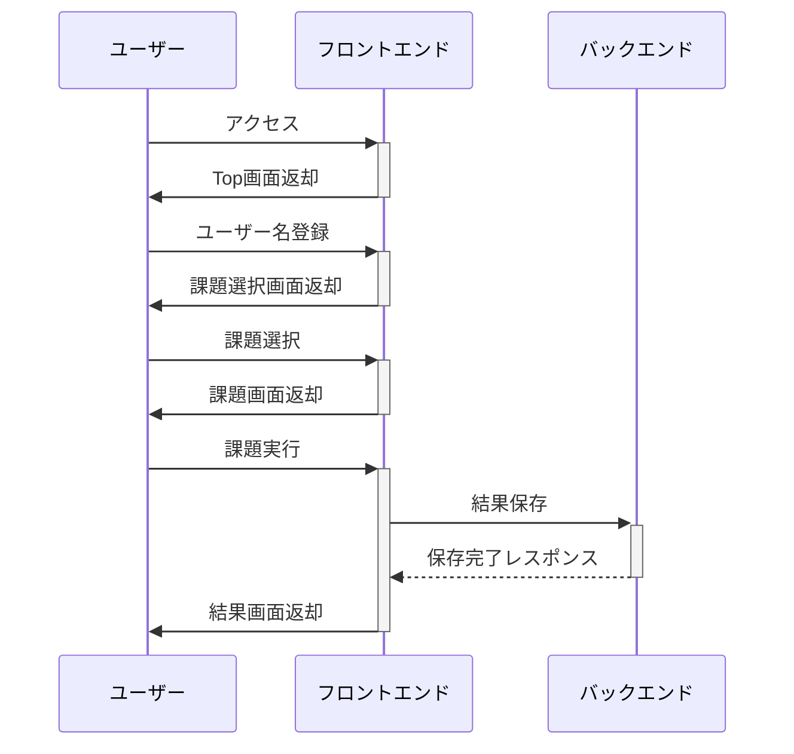
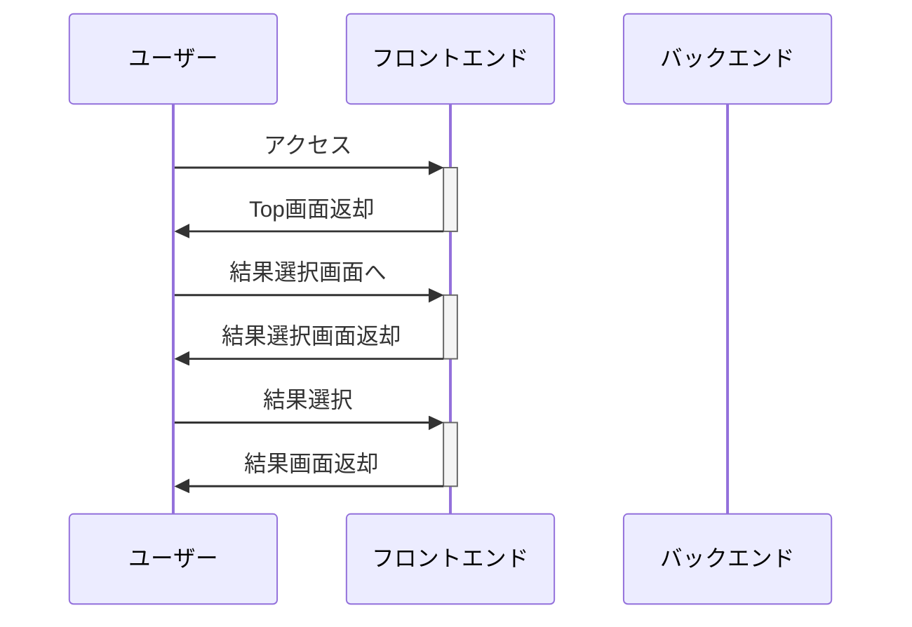
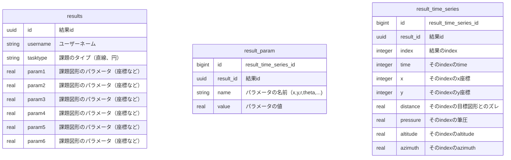

# 本アプリケーションの概要
# シーケンス 
## 課題実行〜結果画面閲覧まで

## 過去データ閲覧 

# 画面一覧
| 画面         | 説明                                            | URL             |
| :----------- | ----------------------------------------------- | --------------- |
| トップ画面   | ・名前入力し課題選択画面へ ・結果選択画面へ  | /top            |
| 課題選択画面 | 正円、縦直線、横直線、楕円を選択できる          | /select_task    |
| 課題実行画面 | 各課題を実行できる                              | /do_task        |
| 結果選択画面 | 閲覧したい過去データを選択できる                | /select_results |
| 結果画面     | 結果idに対応した結果が閲覧できる（result/<id>） | /result/<id>    |
| API画面      | 過去の結果をjson形式で返却する                  | /api/results    |

# 技術構成
## backend
backendのwebサーバーはGo言語で作成した。

主な使用ライブラリは以下の通り。
| 項目                     | 説明                                                                 | 備考                                |
| ------------------------ | :------------------------------------------------------------------- | ----------------------------------- |
| github.com/labstack/echo | webフレームワーク。                                                  |                                     |
| Logger                   | ロガー。                                                             | github.com/labstack/echo/middleware |
| Recover                  | パニックを起こしてもプログラムが 終了しないようにするmiddleware。 | github.com/labstack/echo/middleware |
| gorm.io/gorm             | ORMライブラリ。                                                      |                                     |
| github.com/spf13/viper   | 設定ファイルや環境変数を 簡単に扱えるライブラリ。                 |                                     |

## frontend
frontendはNext.jsを用いて作成した。
| 項目     | 説明                                               | 備考 |
| -------- | :------------------------------------------------- | ---- |
| Next.js  | Reactベースのwebフレームワーク。                   |      |
| three.js | Apple Pencilの動きを3Dで可視化するためのライブラリ |      |
| recoil   | グローバルに状態を管理する ライブラリ。         |      |

## database
データベースはpostgresを使った。テーブルは以下の通り。

